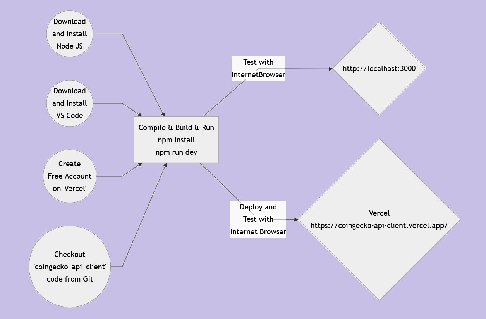
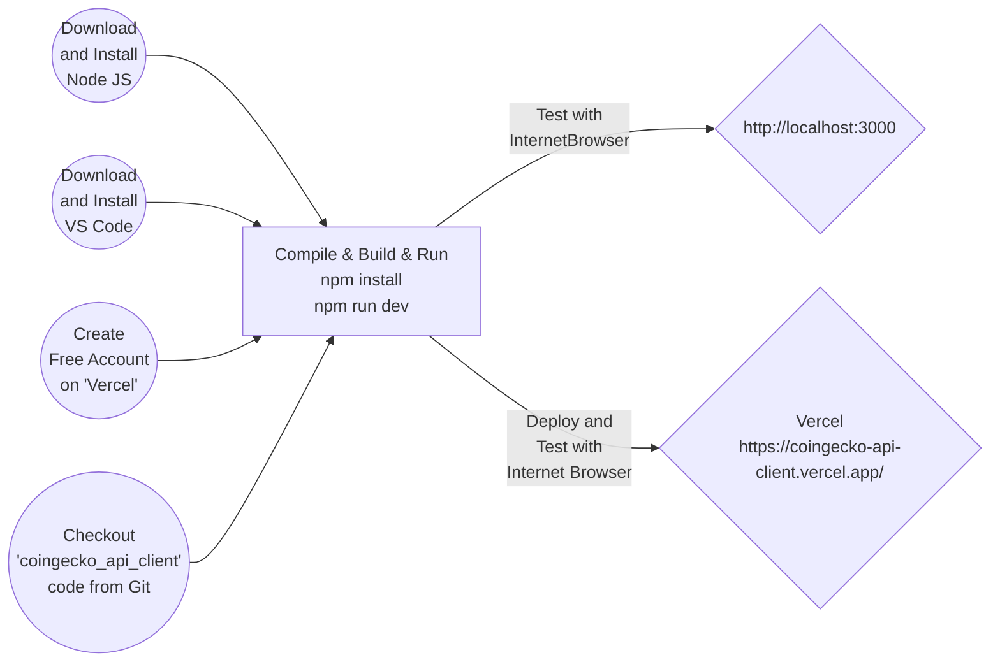

# How to Create Simple Crypto Market Watch Web Application and Deploy it Vercel using CoinGecko API, CDN DataTable & Next JS
### Workflow

### Getting Started
<ul>
<li>Download <a  href="https://nodejs.org/en/download">NodeJS</a> and install</li>
<li>Download <a  href="https://code.visualstudio.com/download">Visual Studio Code</a> and install</li>
<li>Checkout <a  href="https://github.com/lalumastan/coingecko_api_client.git">this code</a> from GitHub</li>
<li>Compile and build the code using <code>npm install</code></li>
<li>Run the development server using <code>npm run dev</code></li>
<li>Open <a  href="http://localhost:3000">http://localhost:3000</a> with your browser to see the result.</li>
<li>You can start reviewing code js files under <code>.../pages/</code> and/or, <code>.../pages/api/coingecko</code>. The page auto-updates as you edit the file.</li>
</ul>

### Deploy on Vercel
The easiest way to deploy your Next.js app is to use the [Vercel Platform](https://vercel.com/new?utm_medium=default-template&filter=next.js&utm_source=create-next-app&utm_campaign=create-next-app-readme) from the creators of Next.js.

Check out the [Next.js deployment documentation](https://nextjs.org/docs/deployment) for more details.

If you already have a Vercel account, just run <code>vercel --prod</code> from project root directory and follow the prompt to deploy.

### References
<ul>
<li><a  href="https://aiweb-icsdiscover.vercel.app/">Advanced AI Web Application Demo</a></li>
<li><a  href="https://coingecko-api-client.vercel.app">Live Demo</a></li>
<li><a  href="https://nextjs.org/learn">Interactive Next.js tutorial</a></li>
<li><a  href="https://nextjs.org/docs">Next.js Documentation</a></li>
<li><a  href="https://reactjs.org/">React</a></li>
<li><a  href="https://vercel.com">Vercel</a></li>
<li><a  href="https://www.coingecko.com/api/documentation">CoinGecko API Documentation</a></li>
</ul>

  

### Tutorial

