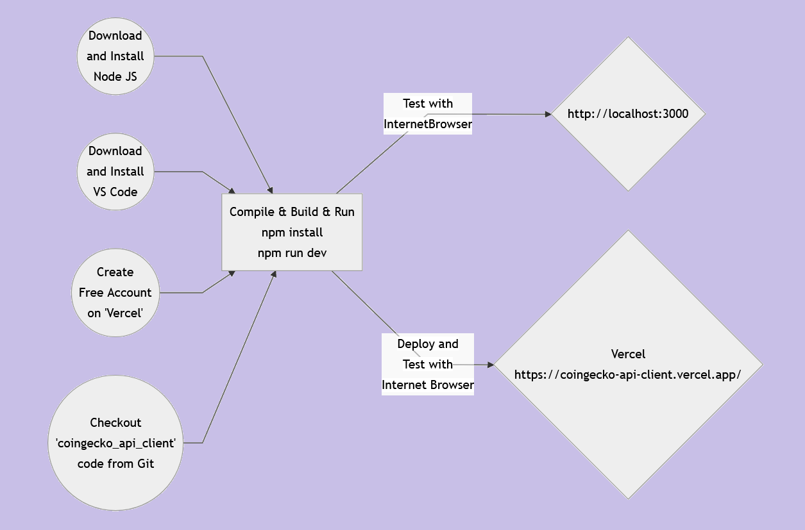
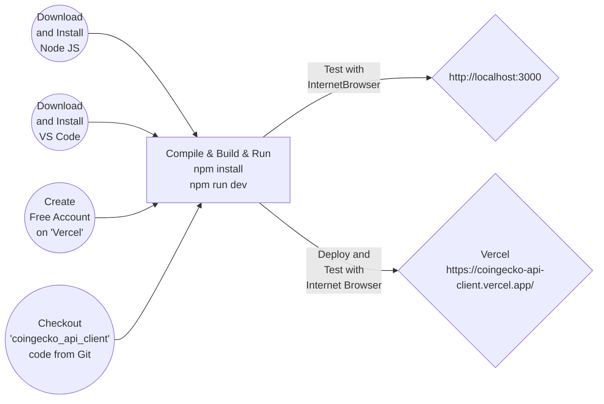

# How to Create a Simple Crypto Market Watch Web Application and Deploy it on Vercel using the CoinGecko API & Next.js

A live, auto-refreshing crypto market dashboard built on the CoinGecko API — sortable, searchable, and rendered in a custom dark-mode terminal-style UI, no jQuery or DataTables required.

### Contents
- [Workflow](#workflow)
- [What's inside](#whats-inside)
- [Getting Started](#getting-started)
- [Deploy on Vercel](#deploy-on-vercel)
- [References](#references)
- [Tutorial](#tutorial)

### Workflow

```mermaid
graph LR
A((Download<br/>and Install<br/>Node JS)) --> F
B((Download<br/>and Install<br/>VS Code)) --> F
C((Create<br/>Free Account<br/>on 'Vercel')) --> F
D((Checkout<br/>'coingecko_api_client'<br/>code from Git)) --> F
F[Compile & Build & Run<br/>npm install<br/>npm run dev]
F -- Test with<br/>InternetBrowser --> H{http://localhost:3000}
F -- Deploy and<br/>Test with<br/>Internet Browser --> G{Vercel<br/>https://coingecko-api-client.vercel.app/}
```

### What's inside
<ul>
<li><code>pages/api/coingecko</code> — server route that calls the CoinGecko <code>/coins/markets</code> endpoint, with an on-disk JSON cache it falls back to if CoinGecko is unreachable or rate-limits the request (HTTP 429).</li>
<li><code>pages/coingeckodatatable.js</code> — the market table itself: client-side search, click-to-sort columns, pagination, and a 60-second auto-refresh with a live countdown indicator.</li>
<li>A custom dark, terminal-inspired UI (deep navy-slate palette, mint/rose gain-loss color coding, monospaced price columns) built with plain React state and hand-written CSS — no jQuery, DataTables, or Bootstrap in the dependency tree.</li>
</ul>

### Getting Started
<ul>
<li>Download <a  href="https://nodejs.org/en/download">NodeJS</a> and install</li>
<li>Download <a  href="https://code.visualstudio.com/download">Visual Studio Code</a> and install</li>
<li>Checkout <a  href="https://github.com/lalumastan/coingecko_api_client.git">this code</a> from GitHub</li>
<li>Compile and build the code using <code>npm install</code></li>
<li>Run the development server using <code>npm run dev</code></li>
<li>Open <a  href="http://localhost:3000">http://localhost:3000</a> with your browser to see the result.</li>
<li>You can start reviewing code js files under <code>.../pages/</code> and/or, <code>.../pages/api/coingecko</code>. The page auto-updates as you edit the file.</li>
</ul>

### Deploy on Vercel
The easiest way to deploy your Next.js app is to use the [Vercel Platform](https://vercel.com/new?utm_medium=default-template&filter=next.js&utm_source=create-next-app&utm_campaign=create-next-app-readme) from the creators of Next.js.

Check out the [Next.js deployment documentation](https://nextjs.org/docs/deployment) for more details.

If you already have a Vercel account, just run <code>vercel --prod</code> from project root directory and follow the prompt to deploy.

### References
<ul>
<li><a  href="https://icsdiscover.great-site.net/?site=aw">Advanced AI Web Application Demo</a></li>
<li><a  href="https://coingecko-api-client.vercel.app">Live Demo</a></li>
<li><a  href="https://nextjs.org/learn">Interactive Next.js tutorial</a></li>
<li><a  href="https://nextjs.org/docs">Next.js Documentation</a></li>
<li><a  href="https://reactjs.org/">React</a></li>
<li><a  href="https://vercel.com">Vercel</a></li>
<li><a  href="https://www.coingecko.com/en/api">CoinGecko API (Use referral code CGICSDISCOVER):</a></li>
</ul>

  

### Tutorial
The video below walks through the original build of this app, which used jQuery DataTables for the market table. The table has since been rebuilt in plain React with a custom dark-mode UI (see [What's inside](#whats-inside)), so the on-screen styling has moved on from the video — the CoinGecko API integration and overall project setup it walks through still apply.

